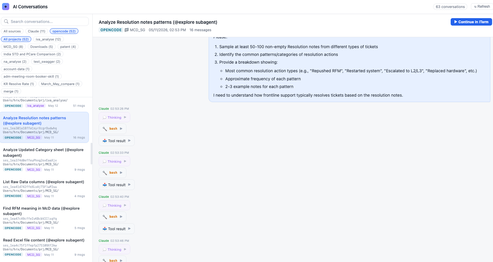

# session-lens

A local web viewer for **Claude Code** & **opencode** conversation history — browse, search, filter by source, and resume any session right in your terminal.

The command line makes it hard to revisit past AI coding conversations. `session-lens` reads your local session history from both Claude Code and opencode, presents it as a searchable list, and renders each conversation as a clean chat transcript.



## Features

- **Two sources, one place** — aggregates Claude Code (`~/.claude/projects/*.jsonl`) and opencode (`~/.local/share/opencode/opencode.db`) sessions side by side.
- **Cascading filters & sort** — filter by source (Claude / opencode), then by project; full-text search over titles; sort by most recent or most messages.
- **Readable transcripts** — your messages on the right, the assistant on the left; Markdown rendering, syntax highlighting, collapsible **Thinking** and **Tool result** blocks.
- **Session metadata** — title, session ID (click to copy), working directory, message count, and timestamps.
- **Resume in your terminal** — one click opens a new iTerm window, `cd`s into the original working directory, and runs the resume command:
  - Claude Code → `claude --resume <id>`
  - opencode → `opencode --session <id>`
- **Rename a session** — type a new title and session-lens generates a shell command to copy and run yourself; it never writes your data:
  - Claude Code → appends an `ai-title` record to the session's `.jsonl`
  - opencode → a `sqlite3 UPDATE` on the session title
- **Delete a session** — also generated as a command to copy and run; session-lens never deletes anything itself:
  - Claude Code → moves the `.jsonl` to the Trash (`trash` / `gio trash`, recoverable)
  - opencode → `opencode session delete <id>` (permanent)

## Requirements

- Python 3.10+ (uses `X | None` type syntax)
- [Flask](https://flask.palletsprojects.com/) — `pip install flask`

Works on **macOS, Linux, Windows, and WSL**. The browser UI is identical everywhere; only the "Continue in terminal" button is platform-specific (see below).

## Usage

```bash
python app.py
```

Then open http://localhost:5678 — the app reads session files directly (nothing is copied or modified). Use the **Refresh** button to re-scan after new conversations.

### Where data is read from

- **Claude Code** — `~/.claude/projects/` (resolved via `Path.home()`, correct on every OS).
- **opencode** — located automatically via `opencode db path`, then the `OPENCODE_DB` env var, then known fallbacks (`~/.local/share/opencode/opencode.db`, `%LOCALAPPDATA%\opencode\...` on Windows). Set `OPENCODE_DB` to override.

> **Using WSL?** Run `python app.py` **inside WSL** — that's where your Claude/opencode data lives, and the Linux paths resolve correctly there. Open http://localhost:5678 in your Windows browser (WSL2 forwards localhost automatically).

### "Continue in terminal" by platform

| Platform | Opens in |
|----------|----------|
| macOS    | iTerm (via `osascript`) |
| Windows  | a new PowerShell window |
| WSL      | a Windows PowerShell window that re-enters WSL and runs the command |
| Linux    | first available terminal (`gnome-terminal`, `konsole`, `xterm`, …) |

If a terminal can't be launched, the command is **copied to your clipboard** instead, so you can paste and run it yourself.

## How it works

- `app.py` — Flask backend. Scans both sources, normalizes them into a unified message format (`text` / `thinking` / `tool_use` / `tool_result` blocks), and exposes a small JSON API:
  - `GET /api/sessions` — session list metadata
  - `GET /api/sessions/<id>` — full conversation
  - `POST /api/sessions/<id>/resume` — open the session in a terminal (platform-aware)
  - `GET /api/sessions/<id>/rename-command?title=…` — generate a rename command (read-only)
  - `GET /api/sessions/<id>/delete-command` — generate a delete command (read-only)
  - `GET /api/reload` — rebuild the in-memory cache
- `index.html` — single-page frontend (no build step; dependencies loaded via CDN).

## License

MIT
